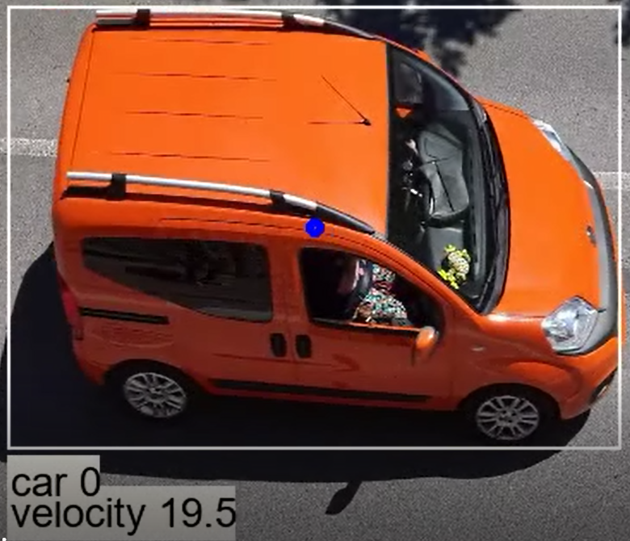
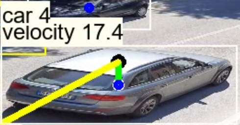

# vehicles-tracking

## Tracking vehicles with neural network models and estimate velocity

Taking an input video depicting a road traveled by cars, the tracking function relies on the results coming out of a neural network model for object detection.
It returns the position and the speed of it creating a history containing the data of all the recognized vehicles

Project has this feature

* Load neural network's model from computer or tensorflow_hub
* Load and write video with openCv
* Analisys frame
  * Pass frame to neural network's model, take result
  * Skim the results for probability percentual and class
  * Compare with historical data of video. add or update value
  * Draw final result on frame
* Write new video
* Create txt with Historical Data

Example

It works with one vehicle like with multiple

if necessary, the function has the possibility of predicting the trajectory of a vehicle, to associate history' value

when analisys ends program writes histoy's list in txt_file and save copy of video

*car 0 has an average speed of 1.2 calculated on 247frames*

*car 1 has an average speed of 1.1 calculated on 243frames*

*car 2 has an average speed of 8.9 calculated on 59frames*

...
